# Vehicle Booking System

Aplikasi pemesanan kendaraan berbasis web untuk perusahaan tambang nikel.

---

## Tech Stack

| Komponen | Versi |
|---|---|
| PHP | 8.2 |
| Framework | Laravel 12 |
| Database | MySQL 8.0+ |
| CSS Framework | Tailwind CSS v3 |
| Node.js | 20+ |
| Package Manager | Composer 2 + NPM |
| Export Excel | maatwebsite/excel ^3.1 |

---

## Akun Login

| Nama | Email | Password | Role | Level |
|---|---|---|---|---|
| Administrator | admin@vehicle.app | admin123 | admin | - |
| Budi Santoso | approver1@vehicle.app | approver123 | approver | 1 |
| Siti Rahayu | approver2@vehicle.app | approver123 | approver | 2 |

---

## Role & Hak Akses

### Admin
- Membuat dan mengelola pemesanan kendaraan
- Menentukan driver dan approver (level 1 & 2)
- Mengelola master data: kendaraan, driver
- Mencatat konsumsi BBM
- Melihat dashboard & grafik pemakaian kendaraan
- Mengekspor laporan periodik ke Excel
- Memantau log aktivitas sistem

### Approver (Level 1 & 2)
- Menyetujui atau menolak pemesanan kendaraan
- Menambahkan catatan saat approve / reject
- Melihat dashboard ringkasan pemesanan pending

---

## Physical Data Model

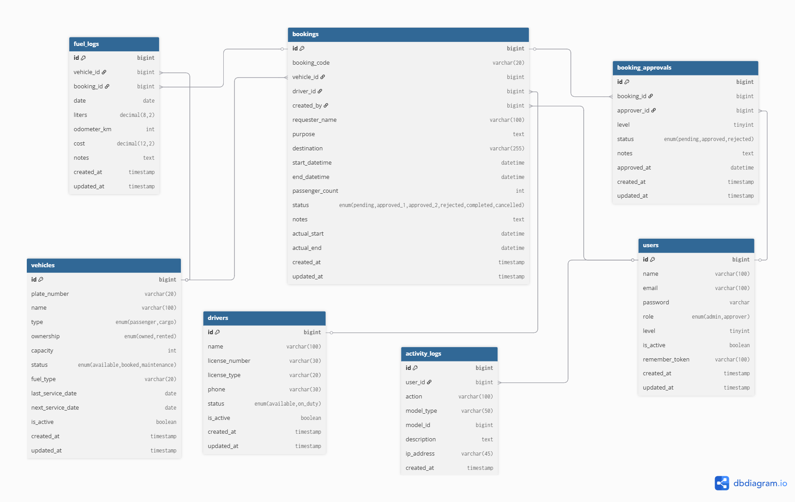

---

## Panduan Instalasi

### 1. Clone Proyek

```bash
git clone https://github.com/Aryhnr/Verhicle-Booking-System-technical-test-.git vehicle-booking
cd vehicle-booking
```

### 2. Install Dependensi

```bash
composer install
npm install
```

### 3. Konfigurasi Environment

```bash
cp .env.example .env
php artisan key:generate
```

Edit file `.env`:

```env
DB_CONNECTION=mysql
DB_HOST=127.0.0.1
DB_PORT=3306
DB_DATABASE=vehicle_booking_db
DB_USERNAME=root
DB_PASSWORD=
```
### 4. Migration & Seeder

```bash
php artisan migrate
php artisan db:seed
```

### 5. Export Excel

Laporan periodik dapat diekspor ke `.xlsx` menggunakan `maatwebsite/excel`.

```bash
composer require maatwebsite/excel
```


### 6. Build Asset

```bash
npm run build
```

### 7. Jalankan Server

```bash
php artisan serve
```

Akses di browser: **http://127.0.0.1:8000**

---

*Vehicle Booking System — Laravel 12 | MySQL 8.0 | Tailwind CSS v4*

---
## Halaman Utama Sistem

### Admin

#### 1. Dashboard
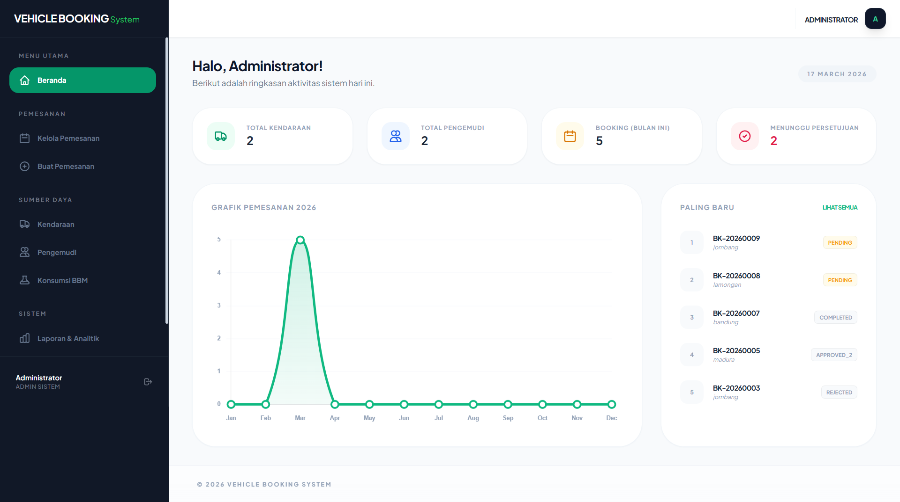

- Route: `/dashboard`
- Menampilkan grafik pemakaian kendaraan & ringkasan data

---

#### 2. Kelola Pemesanan
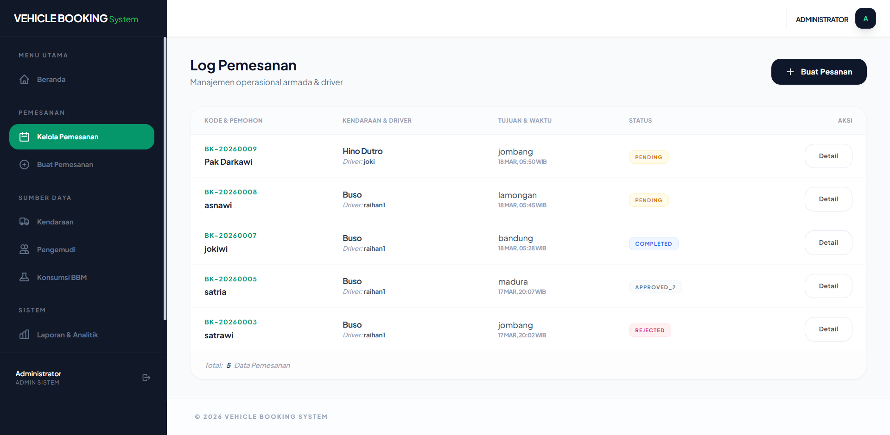

- Route: `/admin/bookings`
- Menampilkan semua data pemesanan kendaraan

---

#### 3. Buat Pemesanan
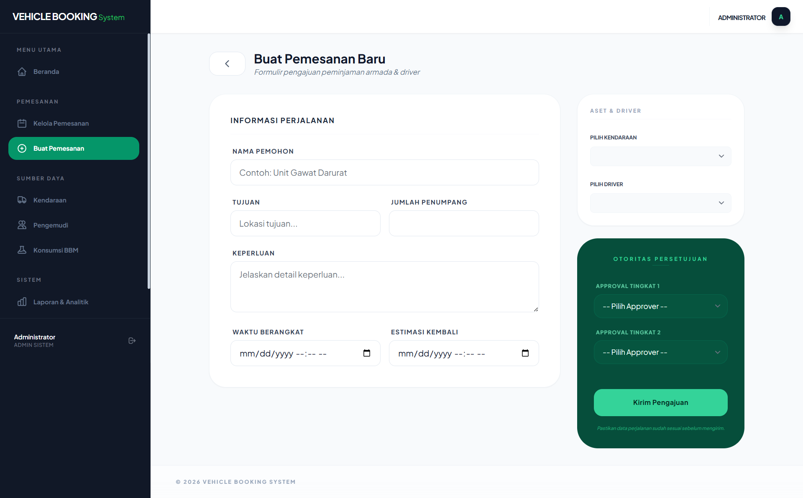

- Route: `/admin/bookings/create`
- Form untuk membuat pemesanan kendaraan baru

---

#### 4. Persetujuan
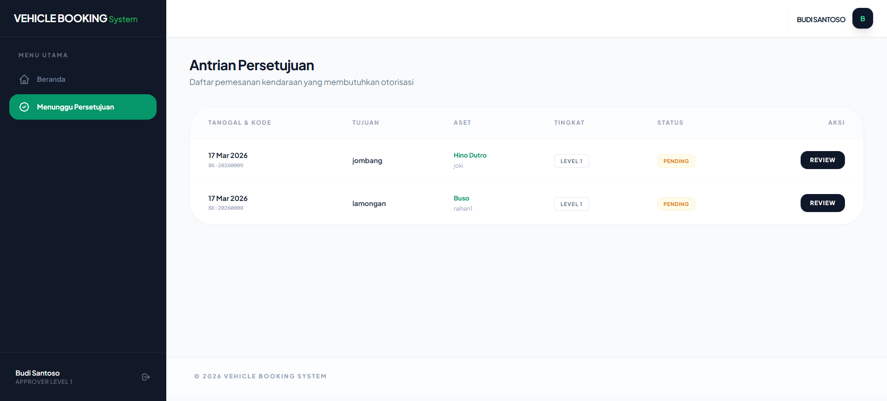

- Route: `/approvals`
- Melihat dan memproses persetujuan pemesanan

---

#### 5. Data Kendaraan
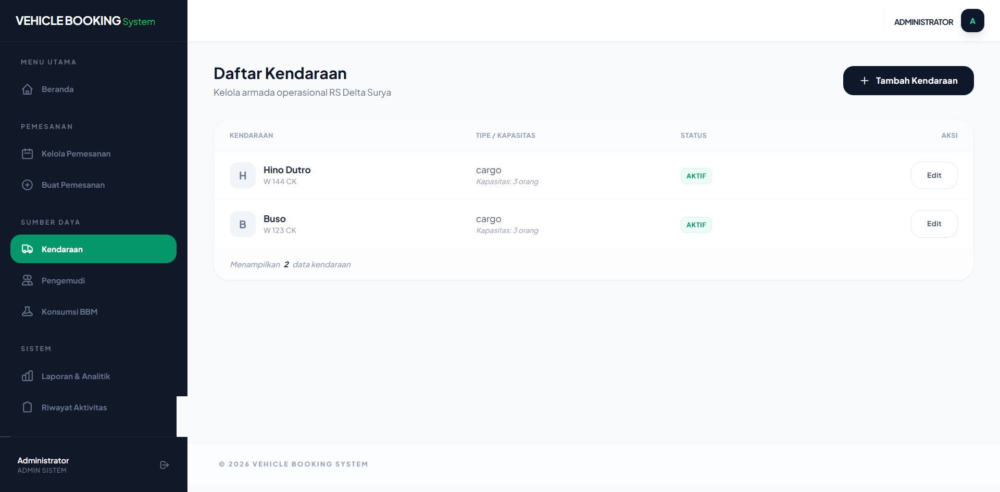

- Route: `/admin/vehicles`
- Manajemen data kendaraan

---

#### 6. Data Driver
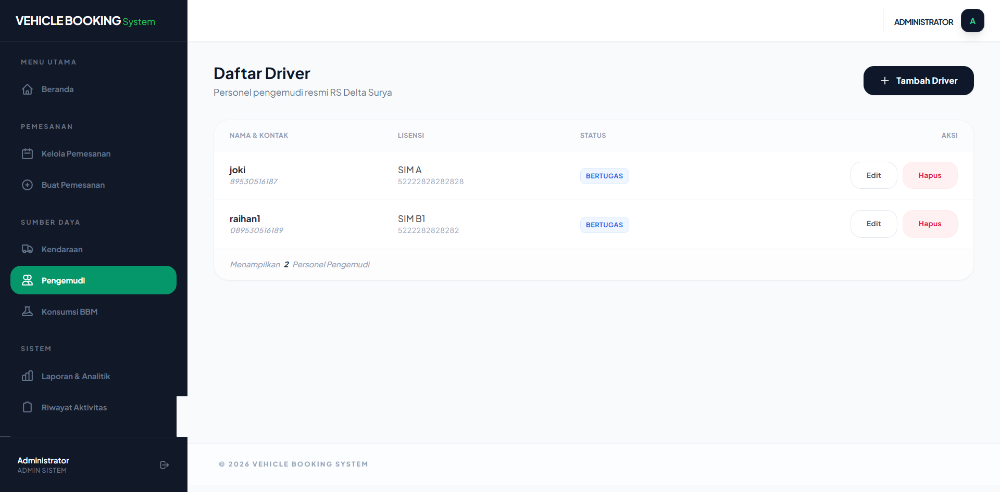

- Route: `/admin/drivers`
- Manajemen data pengemudi

---

#### 7. Konsumsi BBM
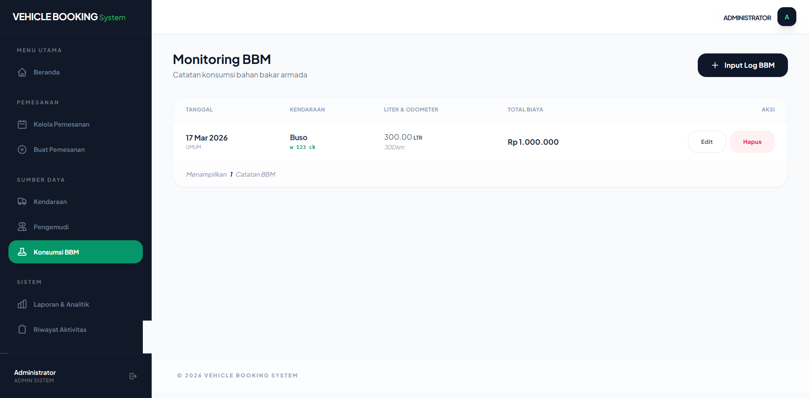

- Route: `/admin/fuel-logs`
- Monitoring penggunaan bahan bakar kendaraan

---

#### 8. Log Aktivitas
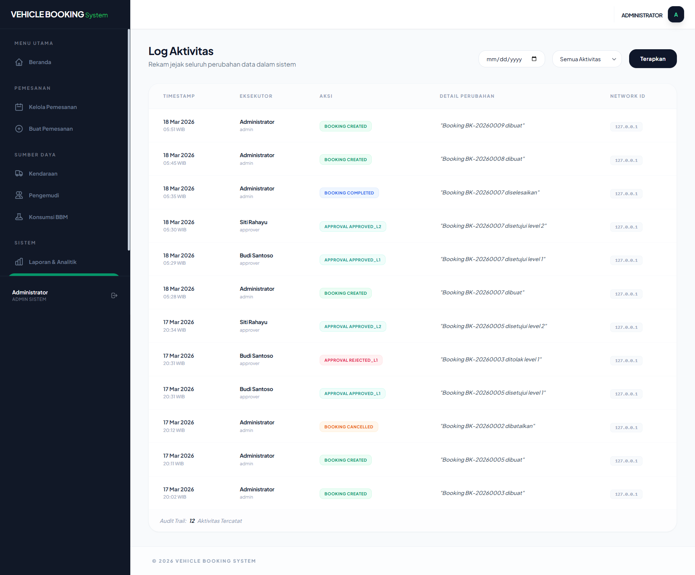

- Route: `/admin/activity-logs`
- Riwayat aktivitas sistem (audit log)

---

#### 9. Laporan
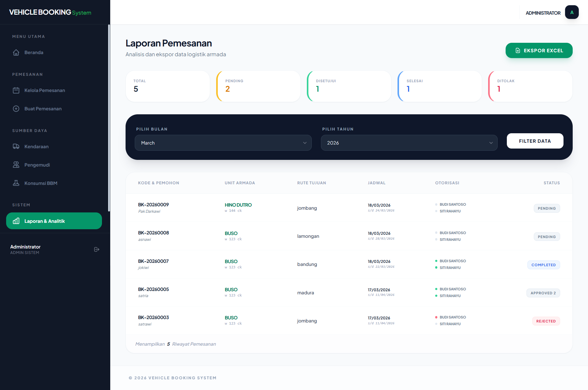

- Route: `/admin/reports`
- Export laporan ke Excel & analisis data

---

### Approver

#### 1. Dashboard
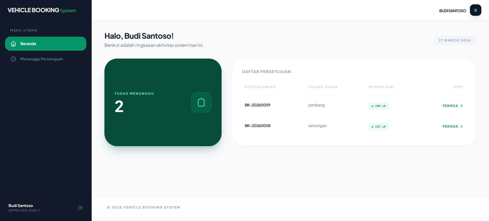

- Route: `/dashboard`
- Ringkasan pemesanan yang perlu disetujui

---

#### 2. Persetujuan


- Route: `/approvals`
- Approve / Reject pemesanan
